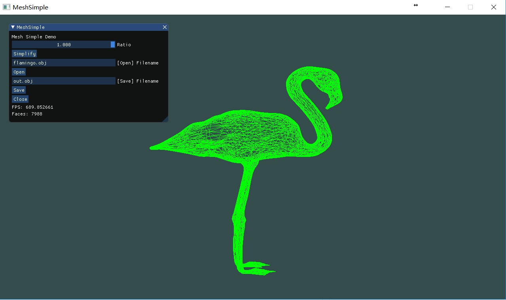
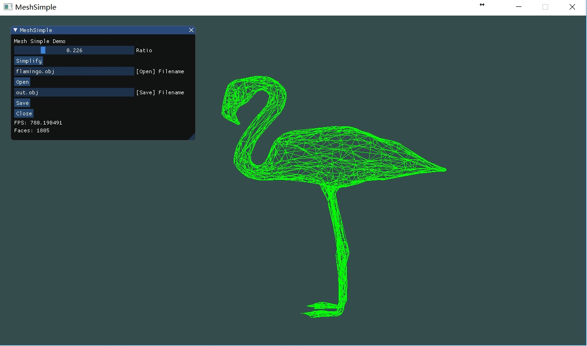
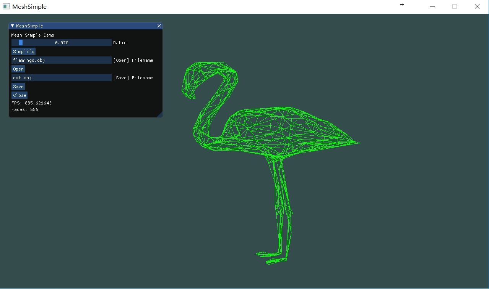

# MeshSimple
An assignment of 'Computer Graphics 2018 Spring' at UCAS.

Mesh simplification method: `Surface Simplification Using Quadric Error Metrics`

## Environment:

+ Visual Studio 2015(Windows 10)
+ OpenGL3.3(GLFW, GLEW)

## Todo: (Welcome PR)

- [ ] Textures and Resoures management
- [ ] Lights
- [ ] IMGUI: Objects list, etc.
- [ ] Camera control

## Screenshots

## Acknowledge
+ https://learnopengl-cn.github.io/
+ https://github.com/ocornut/imgui
